# RecyclerView ItemDecoration

```java 附上系统的DividerItemDecoration

public class DividerItemDecoration extends RecyclerView.ItemDecoration {
    public static final int HORIZONTAL = LinearLayout.HORIZONTAL;
    public static final int VERTICAL = LinearLayout.VERTICAL;

    private static final int[] ATTRS = new int[]{ android.R.attr.listDivider };

    private Drawable mDivider;

    /**
     * Current orientation. Either {@link #HORIZONTAL} or {@link #VERTICAL}.
     */
    private int mOrientation;

    private final Rect mBounds = new Rect();

    /**
     * Creates a divider {@link RecyclerView.ItemDecoration} that can be used with a
     * {@link LinearLayoutManager}.
     *
     * @param context Current context, it will be used to access resources.
     * @param orientation Divider orientation. Should be {@link #HORIZONTAL} or {@link #VERTICAL}.
     */
    public DividerItemDecoration(Context context, int orientation) {
        final TypedArray a = context.obtainStyledAttributes(ATTRS);
        mDivider = a.getDrawable(0);
        a.recycle();
        setOrientation(orientation);
    }

    /**
     * Sets the orientation for this divider. This should be called if
     * {@link RecyclerView.LayoutManager} changes orientation.
     *
     * @param orientation {@link #HORIZONTAL} or {@link #VERTICAL}
     */
    public void setOrientation(int orientation) {
        if (orientation != HORIZONTAL && orientation != VERTICAL) {
            throw new IllegalArgumentException(
                    "Invalid orientation. It should be either HORIZONTAL or VERTICAL");
        }
        mOrientation = orientation;
    }

    /**
     * Sets the {@link Drawable} for this divider.
     *
     * @param drawable Drawable that should be used as a divider.
     */
    public void setDrawable(@NonNull Drawable drawable) {
        if (drawable == null) {
            throw new IllegalArgumentException("Drawable cannot be null.");
        }
        mDivider = drawable;
    }

    @Override
    public void onDraw(Canvas c, RecyclerView parent, RecyclerView.State state) {
        if (parent.getLayoutManager() == null) {
            return;
        }
        if (mOrientation == VERTICAL) {
            drawVertical(c, parent);
        } else {
            drawHorizontal(c, parent);
        }
    }

    @SuppressLint("NewApi")
    private void drawVertical(Canvas canvas, RecyclerView parent) {
        canvas.save();
        final int left;
        final int right;
        if (parent.getClipToPadding()) {
            left = parent.getPaddingLeft();
            right = parent.getWidth() - parent.getPaddingRight();
            canvas.clipRect(left, parent.getPaddingTop(), right,
                    parent.getHeight() - parent.getPaddingBottom());
        } else {
            left = 0;
            right = parent.getWidth();
        }

        final int childCount = parent.getChildCount();
        for (int i = 0; i < childCount; i++) {
            final View child = parent.getChildAt(i);
            parent.getDecoratedBoundsWithMargins(child, mBounds);
            final int bottom = mBounds.bottom + Math.round(ViewCompat.getTranslationY(child));
            final int top = bottom - mDivider.getIntrinsicHeight();
            mDivider.setBounds(left, top, right, bottom);
            mDivider.draw(canvas);
        }
        canvas.restore();
    }

    @SuppressLint("NewApi")
    private void drawHorizontal(Canvas canvas, RecyclerView parent) {
        canvas.save();
        final int top;
        final int bottom;
        if (parent.getClipToPadding()) {
            top = parent.getPaddingTop();
            bottom = parent.getHeight() - parent.getPaddingBottom();
            canvas.clipRect(parent.getPaddingLeft(), top,
                    parent.getWidth() - parent.getPaddingRight(), bottom);
        } else {
            top = 0;
            bottom = parent.getHeight();
        }

        final int childCount = parent.getChildCount();
        for (int i = 0; i < childCount; i++) {
            final View child = parent.getChildAt(i);
            parent.getLayoutManager().getDecoratedBoundsWithMargins(child, mBounds);
            final int right = mBounds.right + Math.round(ViewCompat.getTranslationX(child));
            final int left = right - mDivider.getIntrinsicWidth();
            mDivider.setBounds(left, top, right, bottom);
            mDivider.draw(canvas);
        }
        canvas.restore();
    }

    @Override
    public void getItemOffsets(Rect outRect, View view, RecyclerView parent,
            RecyclerView.State state) {
        if (mOrientation == VERTICAL) {
            outRect.set(0, 0, 0, mDivider.getIntrinsicHeight());
        } else {
            outRect.set(0, 0, mDivider.getIntrinsicWidth(), 0);
        }
    }

```


## 初步自定义

public class ColorItemDecoration extends RecyclerView.ItemDecoration
{
    private static final int DEFAULT_WIDTH = 1;
    private Paint paint;
    //Divider宽度，像素
    private int dividerWidth = 1;
    //Divider方向
    private int orientation = DEFAULT_WIDTH;

    public ColorItemDecoration()
    {
        this(OrientationHelper.HORIZONTAL);
    }

    public ColorItemDecoration(int orientation)
    {
        this(orientation, DEFAULT_WIDTH);
    }

    public ColorItemDecoration(int orientation, int dividerWidth)
    {
        this.orientation = orientation;
        this.dividerWidth = dividerWidth;
        initPaint();
    }

    private void initPaint()
    {
        paint = new Paint();
        paint.setColor(Colors.AERO);
        paint.setStrokeWidth(this.dividerWidth);
    }

    @Override
    public void onDrawOver(Canvas c, RecyclerView parent, RecyclerView.State state)
    {
        super.onDrawOver(c, parent, state);
        if(parent.getLayoutManager() == null)
        {
            return;
        }

        if(orientation == OrientationHelper.HORIZONTAL)
        {
            drawHorizontal(c, parent);
        }
        else
        {
            drawVertical(c, parent);
        }
    }

    private void drawVertical(Canvas c, RecyclerView parent)
    {
        for(int i = 0, count = parent.getChildCount(); i < count; i++)
        {
            View view = parent.getChildAt(i);
            Rect rect = new Rect();
            parent.getDecoratedBoundsWithMargins(view, rect);
            c.drawLine(rect.left, 0, rect.left, rect.bottom, paint);
        }
    }

    private void drawHorizontal(Canvas c, RecyclerView parent)
    {
        for(int i = 0, count = parent.getChildCount(); i < count; i++)
        {
            View view = parent.getChildAt(i);
            Rect rect = new Rect();
            parent.getDecoratedBoundsWithMargins(view, rect);
            c.drawLine(0, rect.top + dividerWidth, parent.getWidth(), rect.top + dividerWidth, paint);
        }
    }


    @Override
    public void getItemOffsets(Rect outRect, View view, RecyclerView parent,
                               RecyclerView.State state)
    {
        super.getItemOffsets(outRect, view, parent, state);
        if(orientation == OrientationHelper.HORIZONTAL)
        {
            outRect.set(0, 0, parent.getWidth(), dividerWidth);
        }
        else
        {
            outRect.set(0, 0, dividerWidth, parent.getHeight());
        }
    }
}

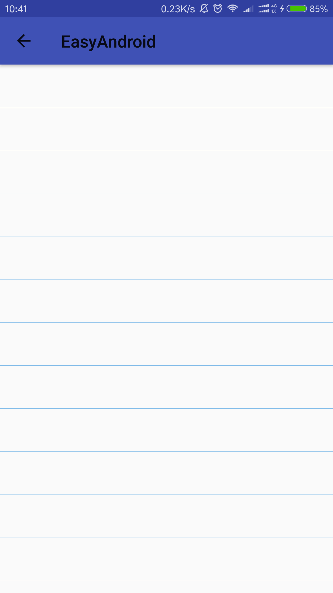


## 数据看不到了，原因是 getItemOffsets有问题

```java

    @Override
    public void getItemOffsets(Rect outRect, View view, RecyclerView parent,
                               RecyclerView.State state)
    {
        super.getItemOffsets(outRect, view, parent, state);
        if(orientation == OrientationHelper.HORIZONTAL)
        {
            outRect.set(0, 0, 0, dividerWidth);
        }
        else
        {
            outRect.set(0, 0, dividerWidth, 0);
        }
    }

```

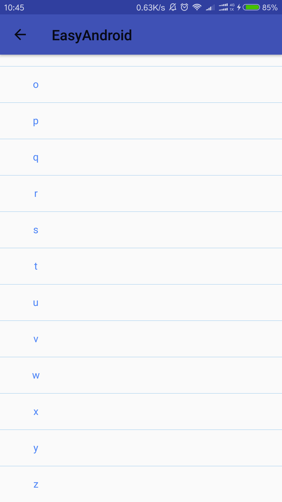


## 问题：GridLayoutManager的ItemDecoration不太完美，先修改横线

```java

    private void drawHorizontal(Canvas c, RecyclerView parent)
    {
        int childCount = parent.getChildCount();
        for(int i = 0; i < childCount; i++)
        {
            View view = parent.getChildAt(i);
            Rect rect = new Rect();
            parent.getDecoratedBoundsWithMargins(view, rect);
            c.drawLine(0, rect.top + dividerWidth, parent.getWidth(), rect.top + dividerWidth,
                    paint);
        }

        int moreDividerCount = getMoreDividerCount(parent);
        if(moreDividerCount >= 0)
        {
            for(int i = childCount - moreDividerCount; i < childCount; i++)
            {
                View view = parent.getChildAt(i);
                Rect rect = new Rect();
                parent.getDecoratedBoundsWithMargins(view, rect);
                c.drawLine(0, rect.bottom + dividerWidth, parent.getWidth(),
                        rect.bottom + dividerWidth, paint);
            }
        }
    }
```

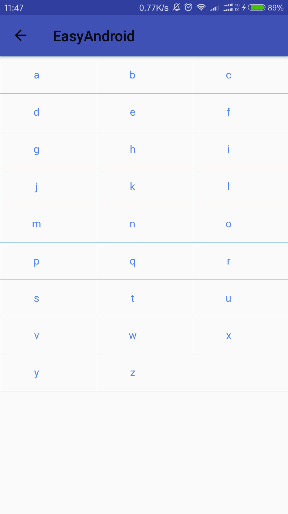

## 依旧不完美，再修改

```java

    private void drawHorizontal(Canvas c, RecyclerView parent)
    {
        int childCount = parent.getChildCount();
        for(int i = 0; i < childCount; i++)
        {
            View view = parent.getChildAt(i);
            Rect rect = new Rect();
            parent.getDecoratedBoundsWithMargins(view, rect);
            c.drawLine(0, rect.top + dividerWidth, rect.width(), rect.top + dividerWidth,
                    paint);
        }

        int moreDividerCount = getMoreDividerCount(parent);
        if(moreDividerCount >= 0)
        {
            for(int i = childCount - moreDividerCount; i < childCount; i++)
            {
                View view = parent.getChildAt(i);
                Rect rect = new Rect();
                parent.getDecoratedBoundsWithMargins(view, rect);
                c.drawLine(0, rect.bottom + dividerWidth, rect.width(),
                        rect.bottom + dividerWidth, paint);
            }
        }
    }

```

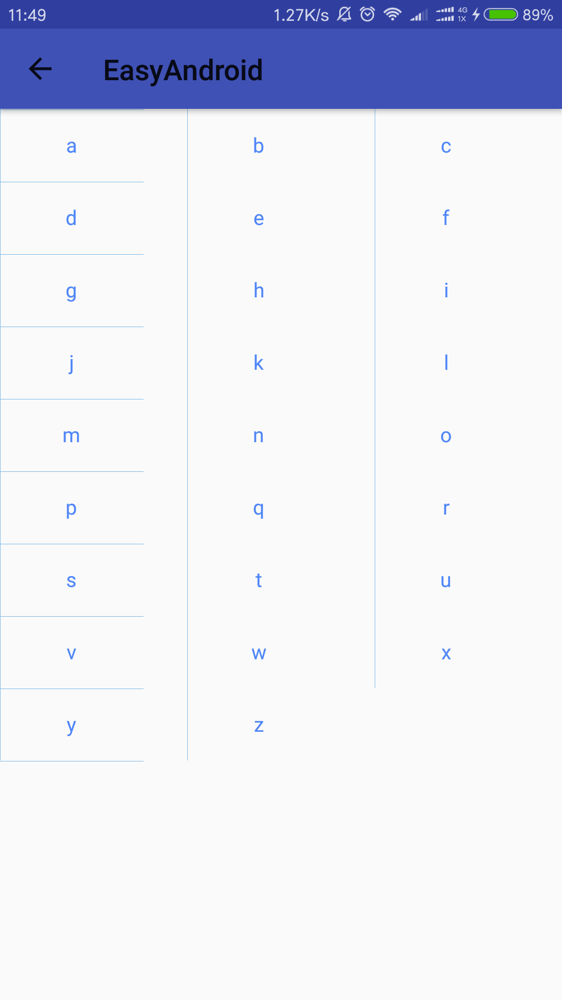

## 问题更多了，继续

```java

    private void drawHorizontal(Canvas c, RecyclerView parent)
    {
        int childCount = parent.getChildCount();
        for(int i = 0; i < childCount; i++)
        {
            View view = parent.getChildAt(i);
            Rect rect = new Rect();
            parent.getDecoratedBoundsWithMargins(view, rect);
            c.drawLine(rect.left, rect.top + dividerWidth, rect.right, rect.top + dividerWidth,
                    paint);
        }

        int moreDividerCount = getMoreDividerCount(parent);
        if(moreDividerCount >= 0)
        {
            for(int i = childCount - moreDividerCount; i < childCount; i++)
            {
                View view = parent.getChildAt(i);
                Rect rect = new Rect();
                parent.getDecoratedBoundsWithMargins(view, rect);
                c.drawLine(rect.left, rect.bottom + dividerWidth, rect.right,
                        rect.bottom + dividerWidth, paint);
            }
        }
    }

```


## 有点意思了，看看DividerItemDecoration的效果

```java

	recyclerView.addItemDecoration(new DividerItemDecoration(this, DividerItemDecoration.VERTICAL));
    recyclerView.addItemDecoration(new DividerItemDecoration(this, DividerItemDecoration.HORIZONTAL));
 

```


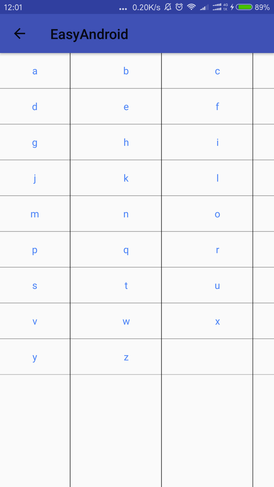

## 这个在GridLayout中就有点凌乱了，改回来，再想想办法

```java

    private void drawHorizontal(Canvas c, RecyclerView parent)
    {
        int itemDividerWidth = getSpanCount(parent);
        int childCount = parent.getChildCount();
        for(int i = 0; i < childCount; i++)
        {
            View view = parent.getChildAt(i);
            Rect rect = new Rect();
            parent.getDecoratedBoundsWithMargins(view, rect);
            c.drawLine(rect.left, rect.top + this.dividerWidth, rect.left + itemDividerWidth,
                    rect.top + this.dividerWidth, paint);
        }

        int moreDividerCount = getMoreDividerCount(parent);
        if(moreDividerCount >= 0)
        {
            for(int i = childCount - moreDividerCount; i < childCount; i++)
            {
                View view = parent.getChildAt(i);
                Rect rect = new Rect();

                parent.getDecoratedBoundsWithMargins(view, rect);
                c.drawLine(rect.left, rect.bottom + this.dividerWidth, rect.left + itemDividerWidth,
                        rect.bottom + this.dividerWidth, paint);
            }
        }
    }

    private int getSpanCount(RecyclerView parent)
    {
        RecyclerView.LayoutManager layoutManager = parent.getLayoutManager();
        if(layoutManager instanceof GridLayoutManager)
        {
            return layoutManager.getWidth() / ((GridLayoutManager) layoutManager).getSpanCount();
        }
        else if(layoutManager instanceof StaggeredGridLayoutManager)
        {
            return layoutManager.getWidth() / ((StaggeredGridLayoutManager) layoutManager)
                    .getSpanCount();
        }
        
        return layoutManager.getWidth();
    }
```


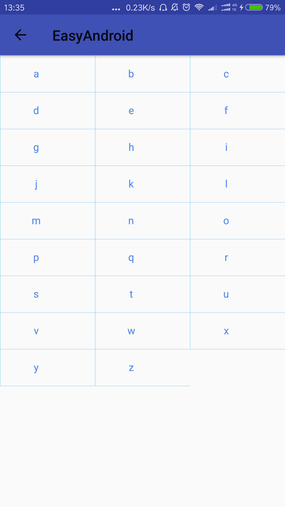

## 现在基本没问题了，再修改纵向的，纵向比较简单，只有最后一个

```java

    private void drawVertical(Canvas c, RecyclerView parent)
    {
        int childCount = parent.getChildCount();
        for(int i = 0; i < childCount; i++)
        {
            View view = parent.getChildAt(i);
            Rect rect = new Rect();
            parent.getDecoratedBoundsWithMargins(view, rect);
            c.drawLine(rect.left, 0, rect.left, rect.bottom, paint);
        }

        int itemDividerWidth = getSpanCount(parent);
        View view = parent.getChildAt(parent.getChildCount() - 1);
        Rect rect = new Rect();
        parent.getDecoratedBoundsWithMargins(view, rect);
        c.drawLine(rect.left + itemDividerWidth, 0, rect.left + itemDividerWidth, rect.bottom,
                paint);
    }
```

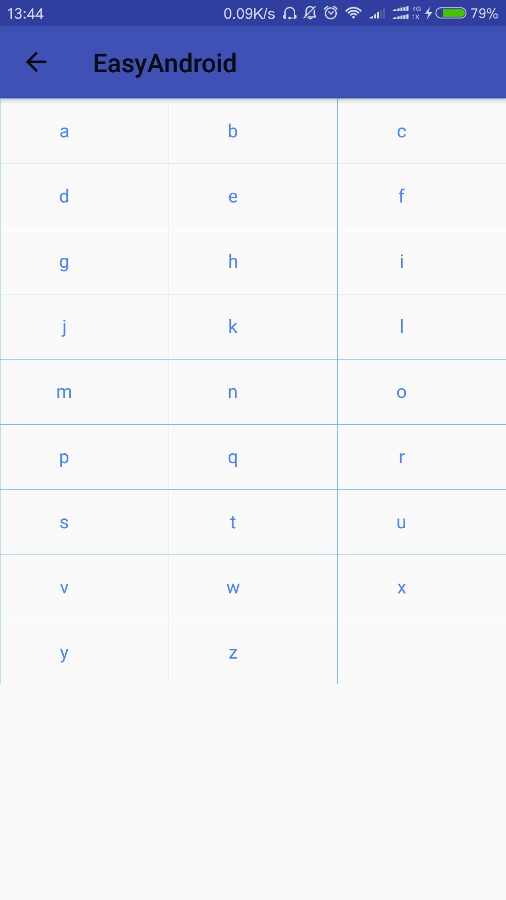

## 现在两个方向都没问题了，再查看Padding和Margin情况下有没有问题

### 首先是RecyclerView，Margin肯定没问题，看Padding有没有问题

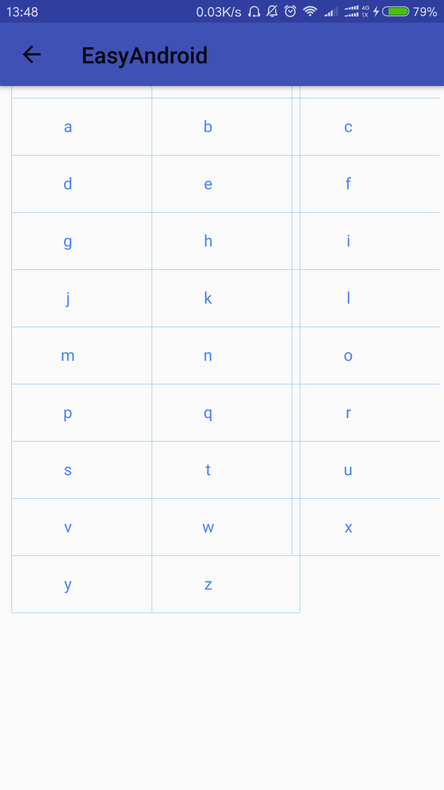


### 这个时候就出问题了，再进行修改

```java

    private void drawVertical(Canvas c, RecyclerView parent)
    {
        int childCount = parent.getChildCount();
        for(int i = 0; i < childCount; i++)
        {
            View view = parent.getChildAt(i);
            Rect rect = new Rect();
            parent.getDecoratedBoundsWithMargins(view, rect);
            c.drawLine(rect.left, rect.top, rect.left, rect.bottom, paint);
        }

        int itemDividerWidth = getSpanCount(parent);
        View view = parent.getChildAt(parent.getChildCount() - 1);
        Rect rect = new Rect();
        parent.getDecoratedBoundsWithMargins(view, rect);
        c.drawLine(rect.left + itemDividerWidth, rect.top, rect.left + itemDividerWidth,
                rect.bottom,
                paint);
    }
```

## 修改这个方法


```java

    private int getSpanCount(RecyclerView parent)
    {
        RecyclerView.LayoutManager layoutManager = parent.getLayoutManager();
        int width = layoutManager.getWidth() - layoutManager.getPaddingLeft() - layoutManager
                .getPaddingRight();
        if(layoutManager instanceof GridLayoutManager)
        {
            return width / ((GridLayoutManager) layoutManager).getSpanCount();
        }
        else if(layoutManager instanceof StaggeredGridLayoutManager)
        {
            return width / ((StaggeredGridLayoutManager) layoutManager)
                    .getSpanCount();
        }

        return width;
    }
```


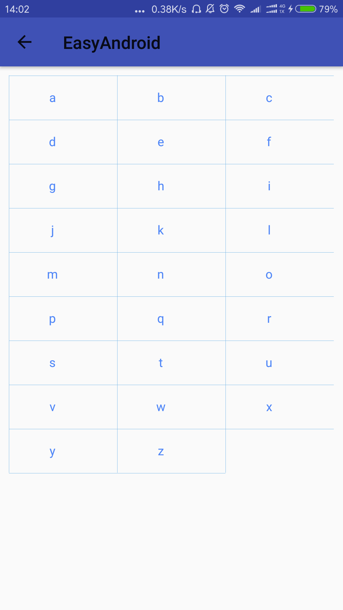


### 那右侧应该怎么修改呢？

```java

@SuppressLint("NewApi")
    private void drawVertical(Canvas c, RecyclerView parent)
    {
        int childCount = parent.getChildCount();
        for(int i = 0; i < childCount; i++)
        {
            View view = parent.getChildAt(i);
            Rect rect = new Rect();
            parent.getDecoratedBoundsWithMargins(view, rect);
            c.drawLine(rect.left, rect.top, rect.left, rect.bottom, paint);
        }

        int itemDividerWidth = getItemDividerWidth(parent);
        int spanCount = getSpanCount(parent);

        if(parent.getClipToPadding())
        {
            for(int i = spanCount - 1; i < childCount; i += spanCount)
            {
                View view = parent.getChildAt(i);
                Rect rect = new Rect();
                parent.getDecoratedBoundsWithMargins(view, rect);
                c.drawLine(rect.left + itemDividerWidth, rect.top, rect.left + itemDividerWidth,
                        rect.bottom, paint);
            }
        }

        View view = parent.getChildAt(parent.getChildCount() - 1);
        Rect rect = new Rect();
        parent.getDecoratedBoundsWithMargins(view, rect);
        c.drawLine(rect.left + itemDividerWidth, rect.top, rect.left + itemDividerWidth,
                rect.bottom, paint);
    
```

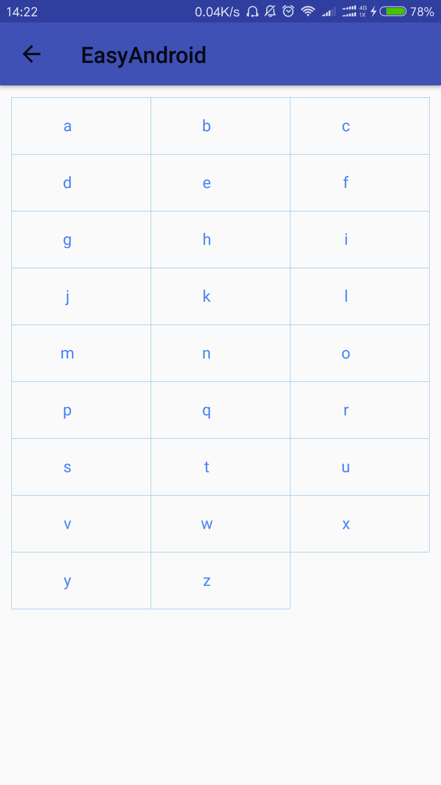


### OK！赞一个！接下来是Item了

#### Margin

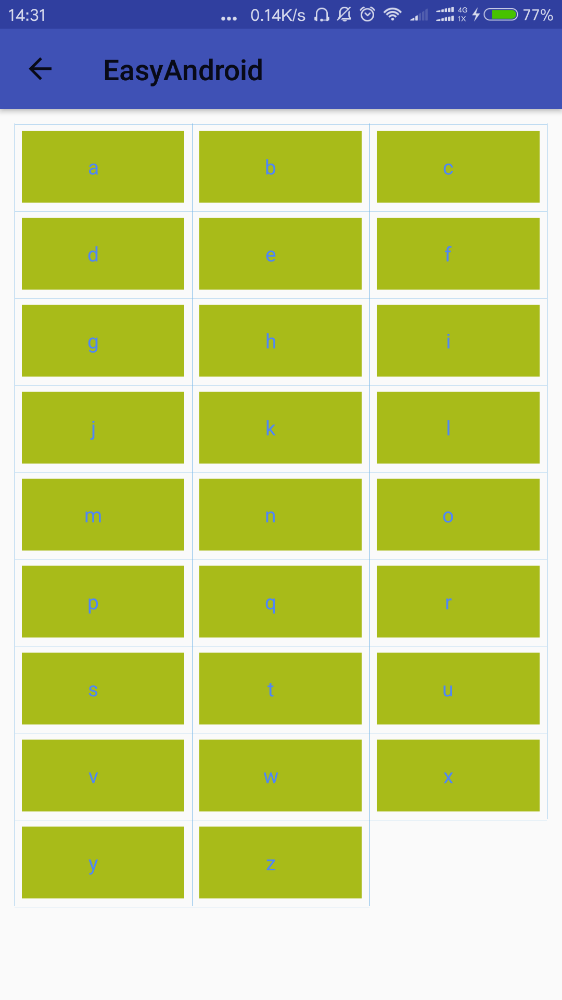

#### Padding

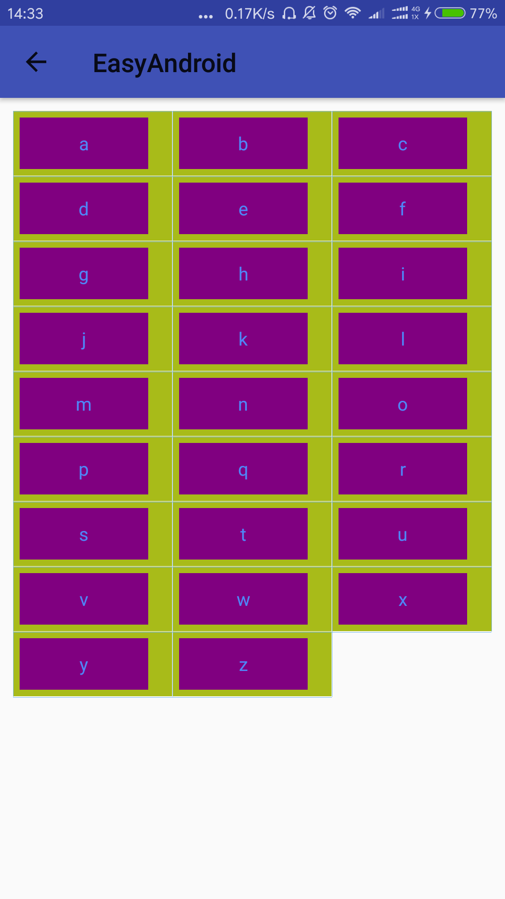

#### Margin + Padding

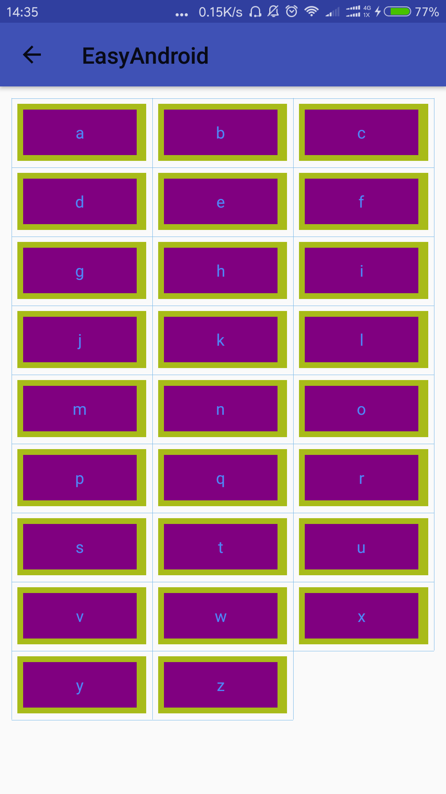

## 暂时没什么问题了，换另外两种LayoutManager看看

### 出问题了

```java
recyclerView.setLayoutManager(
                new LinearLayoutManager(this, LinearLayoutManager.HORIZONTAL, false));
```

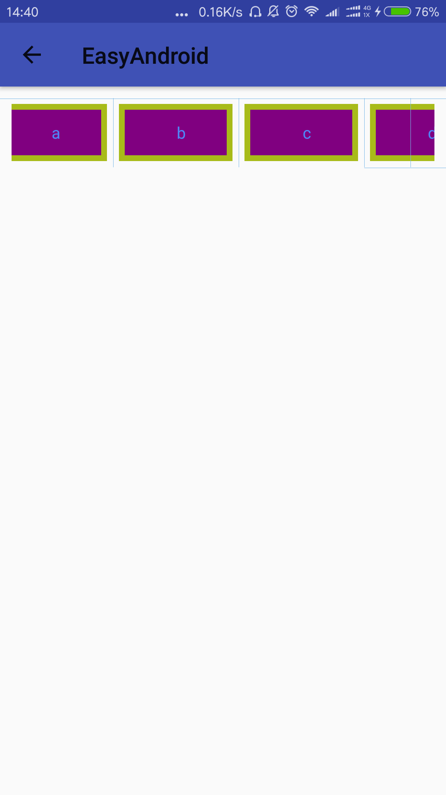

### 修改了一下，但是Divider超出了

```java

@SuppressLint("NewApi")
    private void drawVertical(Canvas c, RecyclerView parent)
    {

        int childCount = parent.getChildCount();
        for(int i = 0; i < childCount; i++)
        {
            View view = parent.getChildAt(i);
            Rect rect = new Rect();
            parent.getDecoratedBoundsWithMargins(view, rect);
            c.drawLine(rect.left, rect.top, rect.left, rect.bottom, paint);
        }

        int itemDividerWidth = getItemDividerWidth(parent);
        int spanCount = getSpanCount(parent);

        if(parent.getClipToPadding())
        {
            for(int i = spanCount - 1; i < childCount; i += spanCount)
            {
                View view = parent.getChildAt(i);
                Rect rect = new Rect();
                parent.getDecoratedBoundsWithMargins(view, rect);
                int left = rect.left + itemDividerWidth;
                c.drawLine(left, rect.top, left, rect.bottom, paint);
            }
        }

        View view = parent.getChildAt(parent.getChildCount() - 1);
        Rect rect = new Rect();
        parent.getDecoratedBoundsWithMargins(view, rect);
        int left = rect.left + itemDividerWidth;
        c.drawLine(left, rect.top, left, rect.bottom, paint);
    }

    private int getSpanCount(RecyclerView parent)
    {
        RecyclerView.LayoutManager layoutManager = parent.getLayoutManager();
        if(layoutManager instanceof GridLayoutManager)
        {
            return ((GridLayoutManager) layoutManager).getSpanCount();
        }
        else if(layoutManager instanceof StaggeredGridLayoutManager)
        {
            return ((StaggeredGridLayoutManager) layoutManager).getSpanCount();
        }
        else if(layoutManager instanceof LinearLayoutManager)
        {
            int orientation = ((LinearLayoutManager) layoutManager).getOrientation();
            if(orientation == LinearLayoutManager.HORIZONTAL)
            {
                return parent.getChildCount();
            }
        }

        return 1;
    }

    @SuppressLint("NewApi")
    private void drawHorizontal(Canvas c, RecyclerView parent)
    {
        int itemDividerWidth = getItemDividerWidth(parent);
        int childCount = parent.getChildCount();
        for(int i = 0; i < childCount; i++)
        {
            View view = parent.getChildAt(i);
            Rect rect = new Rect();
            parent.getDecoratedBoundsWithMargins(view, rect);
            int right = rect.left + itemDividerWidth;
            c.drawLine(rect.left, rect.top, right, rect.top, paint);
        }

        int spanCount = getSpanCount(parent);
        if(spanCount >= 0)
        {
            for(int i = childCount - spanCount; i < childCount; i++)
            {
                View view = parent.getChildAt(i);
                Rect rect = new Rect();
                parent.getDecoratedBoundsWithMargins(view, rect);
                int right = rect.left + itemDividerWidth;
                c.drawLine(rect.left, rect.bottom, right, rect.bottom, paint);
            }
        }
    
```

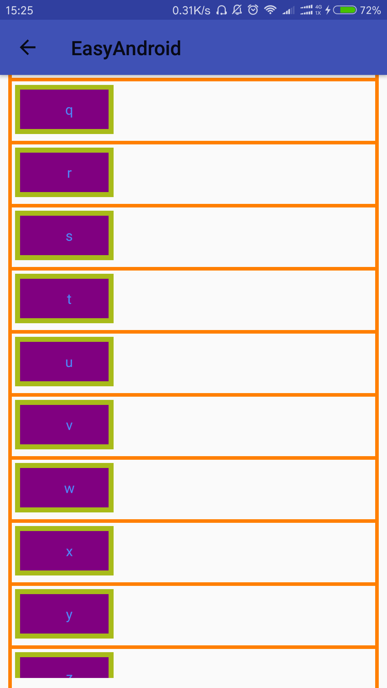

### 接下来就要用到clipRect

```java

 @SuppressLint("NewApi")
    private void drawVertical(Canvas c, RecyclerView parent)
    {
        if(parent.getClipToPadding())
        {
            c.clipRect(parent.getPaddingLeft(), parent.getPaddingTop(),
                    parent.getWidth() - parent.getPaddingRight(),
                    parent.getHeight() - parent.getPaddingBottom());
        }

        int childCount = parent.getChildCount();
        for(int i = 0; i < childCount; i++)
        {
            View view = parent.getChildAt(i);
            Rect rect = new Rect();
            parent.getDecoratedBoundsWithMargins(view, rect);
            c.drawLine(rect.left, rect.top, rect.left, rect.bottom, paint);
        }

        int itemDividerWidth = getItemDividerWidth(parent);
        int spanCount = getSpanCount(parent);

        if(parent.getClipToPadding())
        {
            for(int i = spanCount - 1; i < childCount; i += spanCount)
            {
                View view = parent.getChildAt(i);
                Rect rect = new Rect();
                parent.getDecoratedBoundsWithMargins(view, rect);
                int left = rect.left + itemDividerWidth;
                c.drawLine(left, rect.top, left, rect.bottom, paint);
            }
        }

        View view = parent.getChildAt(parent.getChildCount() - 1);
        Rect rect = new Rect();
        parent.getDecoratedBoundsWithMargins(view, rect);
        int left = rect.left + itemDividerWidth;
        c.drawLine(left, rect.top, left, rect.bottom, paint);
    }

    private int getSpanCount(RecyclerView parent)
    {
        RecyclerView.LayoutManager layoutManager = parent.getLayoutManager();
        if(layoutManager instanceof GridLayoutManager)
        {
            return ((GridLayoutManager) layoutManager).getSpanCount();
        }
        else if(layoutManager instanceof StaggeredGridLayoutManager)
        {
            return ((StaggeredGridLayoutManager) layoutManager).getSpanCount();
        }
        else if(layoutManager instanceof LinearLayoutManager)
        {
            int orientation = ((LinearLayoutManager) layoutManager).getOrientation();
            if(orientation == LinearLayoutManager.HORIZONTAL)
            {
                return parent.getChildCount();
            }
        }

        return 1;
    }

    @SuppressLint("NewApi")
    private void drawHorizontal(Canvas c, RecyclerView parent)
    {
        if(parent.getClipToPadding())
        {
            c.clipRect(parent.getPaddingLeft(), parent.getPaddingTop(),
                    parent.getWidth() - parent.getPaddingRight(),
                    parent.getHeight() - parent.getPaddingBottom());
        }
        int itemDividerWidth = getItemDividerWidth(parent);
        int childCount = parent.getChildCount();
        for(int i = 0; i < childCount; i++)
        {
            View view = parent.getChildAt(i);
            Rect rect = new Rect();
            parent.getDecoratedBoundsWithMargins(view, rect);
            int right = rect.left + itemDividerWidth;
            c.drawLine(rect.left, rect.top, right, rect.top, paint);
        }

        int spanCount = getSpanCount(parent);
        if(spanCount >= 0)
        {
            for(int i = childCount - spanCount; i < childCount; i++)
            {
                View view = parent.getChildAt(i);
                Rect rect = new Rect();
                parent.getDecoratedBoundsWithMargins(view, rect);
                int right = rect.left + itemDividerWidth;
                c.drawLine(rect.left, rect.bottom, right, rect.bottom, paint);
            }
        }
    }
```

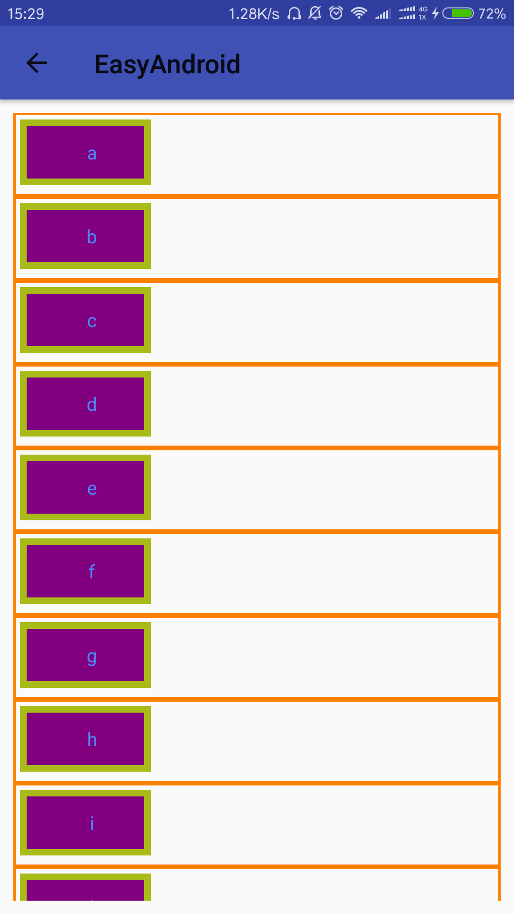

### 看效果，Divider不一样宽了，原因嘛，没切的时候一样宽，那就是切了之后的问题，继续修改

```java

@SuppressLint("NewApi")
    private void drawVertical(Canvas c, RecyclerView parent)
    {
        if(parent.getClipToPadding())
        {
            float suitableDividerWidth = getDividerOffset();
            c.clipRect(parent.getPaddingLeft() - suitableDividerWidth,
                    parent.getPaddingTop() - suitableDividerWidth,
                    parent.getWidth() - parent.getPaddingRight() + suitableDividerWidth,
                    parent.getHeight() - parent.getPaddingBottom() + suitableDividerWidth);
        }

        int childCount = parent.getChildCount();
        for(int i = 0; i < childCount; i++)
        {
            View view = parent.getChildAt(i);
            Rect rect = new Rect();
            parent.getDecoratedBoundsWithMargins(view, rect);
            c.drawLine(rect.left, rect.top, rect.left, rect.bottom, paint);
        }

        int itemDividerWidth = getItemDividerWidth(parent);
        int spanCount = getSpanCount(parent);

        if(parent.getClipToPadding())
        {
            for(int i = spanCount - 1; i < childCount; i += spanCount)
            {
                View view = parent.getChildAt(i);
                Rect rect = new Rect();
                parent.getDecoratedBoundsWithMargins(view, rect);
                int left = rect.left + itemDividerWidth;
                c.drawLine(left, rect.top, left, rect.bottom, paint);
            }
        }

        View view = parent.getChildAt(parent.getChildCount() - 1);
        Rect rect = new Rect();
        parent.getDecoratedBoundsWithMargins(view, rect);
        int left = rect.left + itemDividerWidth;
        c.drawLine(left, rect.top, left, rect.bottom, paint);
    }

    private int getSpanCount(RecyclerView parent)
    {
        RecyclerView.LayoutManager layoutManager = parent.getLayoutManager();
        if(layoutManager instanceof GridLayoutManager)
        {
            return ((GridLayoutManager) layoutManager).getSpanCount();
        }
        else if(layoutManager instanceof StaggeredGridLayoutManager)
        {
            return ((StaggeredGridLayoutManager) layoutManager).getSpanCount();
        }
        else if(layoutManager instanceof LinearLayoutManager)
        {
            int orientation = ((LinearLayoutManager) layoutManager).getOrientation();
            if(orientation == LinearLayoutManager.HORIZONTAL)
            {
                return parent.getChildCount();
            }
        }

        return 1;
    }

    @SuppressLint("NewApi")
    private void drawHorizontal(Canvas c, RecyclerView parent)
    {
        if(parent.getClipToPadding())
        {
            float suitableDividerWidth = getDividerOffset();
            c.clipRect(parent.getPaddingLeft() - suitableDividerWidth,
                    parent.getPaddingTop() - suitableDividerWidth,
                    parent.getWidth() - parent.getPaddingRight() + suitableDividerWidth,
                    parent.getHeight() - parent.getPaddingBottom() + suitableDividerWidth);
        }
        
        int itemDividerWidth = getItemDividerWidth(parent);
        int childCount = parent.getChildCount();
        for(int i = 0; i < childCount; i++)
        {
            View view = parent.getChildAt(i);
            Rect rect = new Rect();
            parent.getDecoratedBoundsWithMargins(view, rect);
            int right = rect.left + itemDividerWidth;
            c.drawLine(rect.left, rect.top, right, rect.top, paint);
        }

        int spanCount = getSpanCount(parent);
        if(spanCount >= 0)
        {
            for(int i = childCount - spanCount; i < childCount; i++)
            {
                View view = parent.getChildAt(i);
                Rect rect = new Rect();
                parent.getDecoratedBoundsWithMargins(view, rect);
                int right = rect.left + itemDividerWidth;
                c.drawLine(rect.left, rect.bottom, right, rect.bottom, paint);
            }
        }
    }

    private float getDividerOffset()
    {
        return dividerWidth / 2f;
    }
```

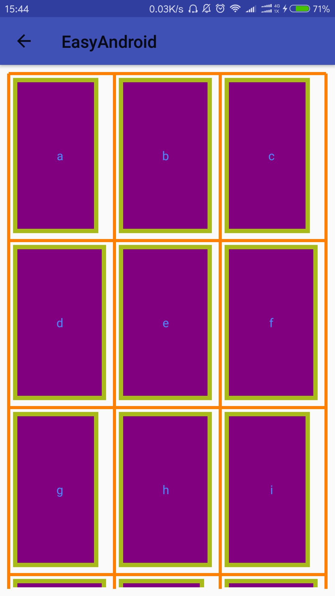

### 这时候就没什么问题了，还有最后一个流式布局

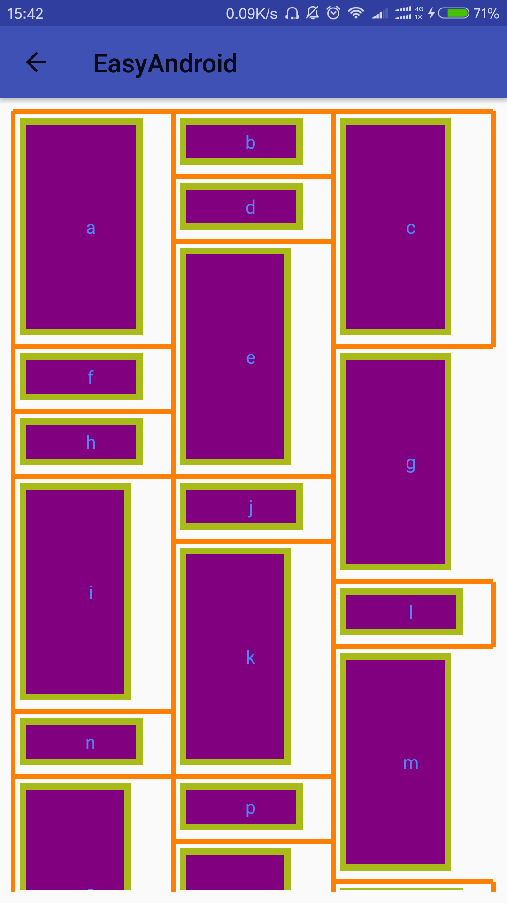

### 惨不忍睹，接下来就不自定义了，这个直接给每个Item完全加框最简单了。现在，贴上这个类的全部代码，然后收集到我的开源库[EasyAndroid](https://github.com/Ayvytr/EasyAndroid)里头

```java

public class PrettyItemDecoration extends RecyclerView.ItemDecoration
{
    private static final int DEFAULT_WIDTH = 1;
    public static final int HORIZONTAL = OrientationHelper.HORIZONTAL;
    public static final int VERTICAL = OrientationHelper.VERTICAL;

    private Paint paint;
    //Divider宽度，像素
    private int dividerWidth = 1;
    //Divider方向
    private int orientation = DEFAULT_WIDTH;
    @ColorInt
    private int color;

    public PrettyItemDecoration()
    {
        this(OrientationHelper.HORIZONTAL);
    }

    public PrettyItemDecoration(int orientation)
    {
        this(orientation, Colors.AERO);
    }

    public PrettyItemDecoration(int orientation, @ColorInt int color)
    {
        this(orientation, color, DEFAULT_WIDTH);
    }

    public PrettyItemDecoration(int orientation, @ColorInt int color, int dividerWidth)
    {
        this.orientation = orientation;
        this.color = color;
        this.dividerWidth = dividerWidth;
        initPaint();
    }

    private void initPaint()
    {
        paint = new Paint();
        paint.setColor(color);
        paint.setStrokeWidth(this.dividerWidth);
    }

    @Override
    public void onDrawOver(Canvas c, RecyclerView parent, RecyclerView.State state)
    {
        super.onDrawOver(c, parent, state);
        if(parent.getLayoutManager() == null)
        {
            return;
        }

        if(orientation == OrientationHelper.HORIZONTAL)
        {
            drawHorizontal(c, parent);
        }
        else
        {
            drawVertical(c, parent);
        }
    }

    @SuppressLint("NewApi")
    private void drawVertical(Canvas c, RecyclerView parent)
    {
        if(parent.getClipToPadding())
        {
            float suitableDividerWidth = getDividerOffset();
            c.clipRect(parent.getPaddingLeft() - suitableDividerWidth,
                    parent.getPaddingTop() - suitableDividerWidth,
                    parent.getWidth() - parent.getPaddingRight() + suitableDividerWidth,
                    parent.getHeight() - parent.getPaddingBottom() + suitableDividerWidth);
        }

        int childCount = parent.getChildCount();
        for(int i = 0; i < childCount; i++)
        {
            View view = parent.getChildAt(i);
            Rect rect = new Rect();
            parent.getDecoratedBoundsWithMargins(view, rect);
            c.drawLine(rect.left, rect.top, rect.left, rect.bottom, paint);
        }

        int itemDividerWidth = getItemDividerWidth(parent);
        int spanCount = getSpanCount(parent);

        if(parent.getClipToPadding())
        {
            for(int i = spanCount - 1; i < childCount; i += spanCount)
            {
                View view = parent.getChildAt(i);
                Rect rect = new Rect();
                parent.getDecoratedBoundsWithMargins(view, rect);
                int left = rect.left + itemDividerWidth;
                c.drawLine(left, rect.top, left, rect.bottom, paint);
            }
        }

        View view = parent.getChildAt(parent.getChildCount() - 1);
        Rect rect = new Rect();
        parent.getDecoratedBoundsWithMargins(view, rect);
        int left = rect.left + itemDividerWidth;
        c.drawLine(left, rect.top, left, rect.bottom, paint);
    }

    private int getSpanCount(RecyclerView parent)
    {
        RecyclerView.LayoutManager layoutManager = parent.getLayoutManager();
        if(layoutManager instanceof GridLayoutManager)
        {
            return ((GridLayoutManager) layoutManager).getSpanCount();
        }
        else if(layoutManager instanceof StaggeredGridLayoutManager)
        {
            return ((StaggeredGridLayoutManager) layoutManager).getSpanCount();
        }
        else if(layoutManager instanceof LinearLayoutManager)
        {
            int orientation = ((LinearLayoutManager) layoutManager).getOrientation();
            if(orientation == LinearLayoutManager.HORIZONTAL)
            {
                return parent.getChildCount();
            }
        }

        return 1;
    }

    @SuppressLint("NewApi")
    private void drawHorizontal(Canvas c, RecyclerView parent)
    {
        if(parent.getClipToPadding())
        {
            float suitableDividerWidth = getDividerOffset();
            c.clipRect(parent.getPaddingLeft() - suitableDividerWidth,
                    parent.getPaddingTop() - suitableDividerWidth,
                    parent.getWidth() - parent.getPaddingRight() + suitableDividerWidth,
                    parent.getHeight() - parent.getPaddingBottom() + suitableDividerWidth);
        }

        int itemDividerWidth = getItemDividerWidth(parent);
        int childCount = parent.getChildCount();
        for(int i = 0; i < childCount; i++)
        {
            View view = parent.getChildAt(i);
            Rect rect = new Rect();
            parent.getDecoratedBoundsWithMargins(view, rect);
            int right = rect.left + itemDividerWidth;
            c.drawLine(rect.left, rect.top, right, rect.top, paint);
        }

        int spanCount = getSpanCount(parent);
        if(spanCount >= 0)
        {
            for(int i = childCount - spanCount; i < childCount; i++)
            {
                View view = parent.getChildAt(i);
                Rect rect = new Rect();
                parent.getDecoratedBoundsWithMargins(view, rect);
                int right = rect.left + itemDividerWidth;
                c.drawLine(rect.left, rect.bottom, right, rect.bottom, paint);
            }
        }
    }

    private float getDividerOffset()
    {
        return dividerWidth / 2f;
    }

    private int getItemDividerWidth(RecyclerView parent)
    {
        RecyclerView.LayoutManager layoutManager = parent.getLayoutManager();
        int width = layoutManager.getWidth() - layoutManager.getPaddingLeft() - layoutManager
                .getPaddingRight();
        if(layoutManager instanceof GridLayoutManager)
        {
            return width / ((GridLayoutManager) layoutManager).getSpanCount();
        }
        else if(layoutManager instanceof StaggeredGridLayoutManager)
        {
            return width / ((StaggeredGridLayoutManager) layoutManager)
                    .getSpanCount();
        }

        return width;
    }

    @Override
    public void getItemOffsets(Rect outRect, View view, RecyclerView parent,
                               RecyclerView.State state)
    {
        super.getItemOffsets(outRect, view, parent, state);
        if(orientation == OrientationHelper.HORIZONTAL)
        {
            outRect.set(0, 0, 0, dividerWidth);
        }
        else
        {
            outRect.set(0, 0, dividerWidth, 0);
        }
    }
}

```